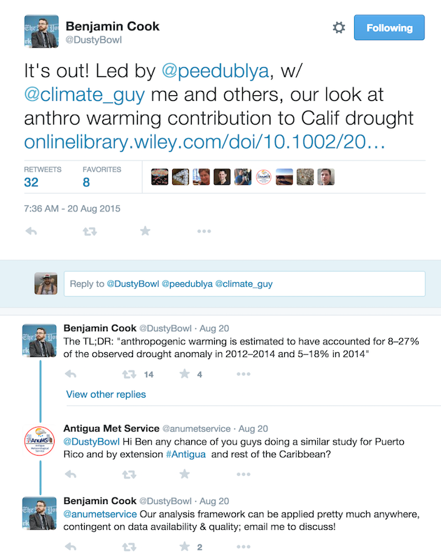
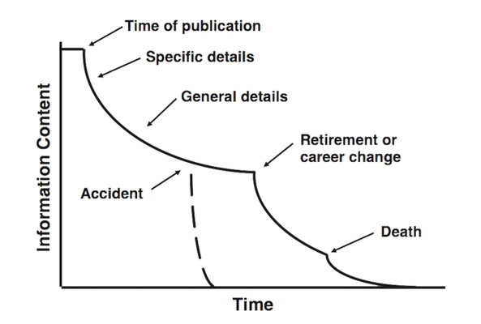
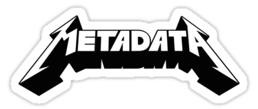
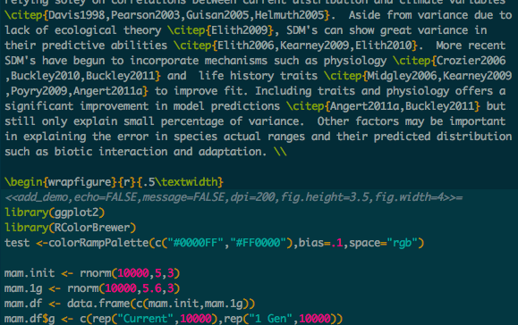
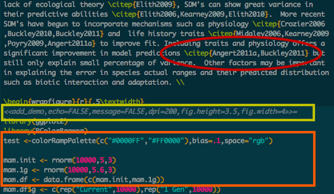
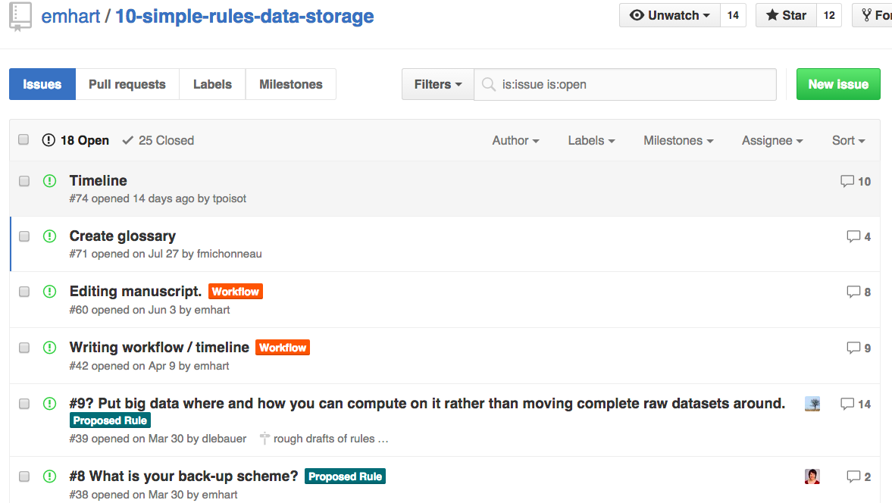
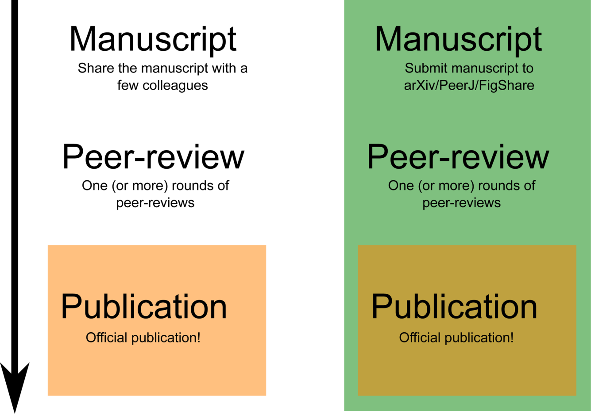
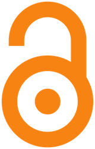

 *"the major hurdle to overcome when trying to convince others that we should strive for Open Science: it is a major pain in the ass and is really expensive, in terms of both the money and amount of time required.* 

.fragment *We need to stop telling people 'You should' and get better at telling people 'Here’s how' "* - Emilio Bruna, UF, editor Biotropica

--- ds:noborder
## What is the open science stack?

A stack is a complete group of components that work together to produce a goal.

--- ds:noborder
## What is the open science stack?

  
* Open lab notebooks / sharing
* Open Data
* Open Source / code sharing
* Reproducible writing
* Open Access / pre-prints
  
  
__Open science stack is all the tools you need to produce open science__

--- ds:noborder

## Open lab notebook
*http://www.carlboettiger.info/lab-notebook.html*

 

--- ds:noborder

## Virtual department on twitter

 
*(Figure 2A - Darling et al 2013)*

--- &twocol ds:noborder

## Virtual department on twitter
Share early results or discuss major findings with primary authors in other departments
*** =left

*** =right

--- 

## Open Lab notebook / Twitter
  

> * Open lab notebooks = amazing provenance / opportunity for engagement 
> * Open lab notebooks can require more technical skill to set-up
> * Sharing on Twitter / blogs is easier
> * Twitter is a poor platform for idea provenance

---

## Open Lab notebook / Twitter
  

.fragment *"This evidence suggests that the practice of open notebook science can faciliate both the performance and dissemination of research while remaining compatible and even synergistic with academic publishing." - Carl Boettiger*
  

.fragment *"...we believe there can be great and unexpected value to including social media into the life cycle of a scientific paper." - Darling et al 2013*

---

## Open data
 
 
*“Open data and content can be freely used, modified, and shared by anyone for any purpose” - Open Knowledge Foundation*

--- &twocol ds:noborder

## Advantages of open data

Your data can be used long after you're gone

*** =left

*** =right

*(Figure 1D - Vines et al 2014)*

--- ds:noborder

## Advantages of open data

Increased citation (9%)

*(Figure 2 - Piowar and Vision 2013)*

--- ds:noborder

## Have a plan for your data

(dataone.org)

http://dmptool.org     

---

## TL;DR rules for sharing open data
  
> 1. Use an open format
> 2. Use a metadata standards
> 3. Use an open license
> 4. Use an open repository

---

## Open data formats
  
**What makes a format open?**
 
> * ASCII based
> * Binary but maintained by an open consortium
> * Machine independent
> * Machine readable (should be)

--- &twocol ds:noborder

## Data format examples

*** =left

**Open**

* FASTA / EMBL / Genbank
* NeXML / NEXUS
* GeoJSON / KML
* CSV
* NetCDF/HDF5

*** =right
**Closed** 

* Excel
* Any proprietary DB
  * Oracle
  * Access
* ESRI shape file

--- ds:noborder

   

> * Know your discipline specific standard
> * Know your funding agency policy
> * Know your journal's policy
> * Know your repository's policy

--- ds:noborder

  
**Some metadata standards**

 
> * *EML* - Ecology
> * *Darwin Core* - Biodiversity data
> * *CF* - Climate data
> * *ISO 19115* - GIS data
> * *MIMS / MIMARK* - Genomic / Metagenomic data

--- ds:noborder

## License please!

  

*"To anyone who wants to photocopy, bind, and give a copy of the book to their loved one — more power to them. He/She will likely be disappointed that you’re so cheap, though." - Randall Munroe (xkcd)* 

--- ds:noborder

## License please!
  

Your most open choice, public domain!
 

.fragment Choose a Creative Commons license that fits your comfort level 
 

.fragment No license does not mean your data is open!
 

http://creativecommons.org/choose/

---

## Data repositories
  
**Ideally:**

> * Persistent with fail safes
> * Require metadata
> * Allow versioning
> * Issue a DOI for citability
> * Be open (with an API)!

---
## Data repositories
  
**Some suggestions**
 
* *General purpose* - Figshare / Zenodo 
* *Biodiversity* - GBIF / KNB
* *Nucleic acid sequences* - Genbank / EMBL
  

For more suggestions:

http://www.nature.com/sdata/data-policies/repositories

http://journals.plos.org/plosone/s/data-availability

--- ds:noborder

## Open source / code sharing

  

---

## Advantages of open source
  
> * Facilitates reproducibility 
> * Enables collaboration
> * Incentivises writing clean code (future you thanks you)
> * More people will use what you build

--- 

## Sharing code
  
> * Use version control! (git / <strike>svn</strike>)
> * Write human readable comments
> * Use a license (MIT / GPL / BSD)
> * Share on a public repository (GitHub / Bitbucket)
> * Use an open source platform (e.g. **NOT** matlab, mathematica)
> * Distribute it (CRAN / pipy)
> * Archive releases and assign DOI's
  
http://guides.github.com/activities/citable-code/

--- ds:noborder

## Sharing code and data

  
Wolkovich et al. 2012

--- &twocol ds:noborder

## Reproducible documents
  
PDF text and figures is generated from code on the left
*** =left

*** =right

---ds:noborder
 
## Reproducible documents
  
Code snippets embedded in text formatting

&nbsp;&nbsp;&nbsp;&nbsp;

---ds:noborder
 
## Reproducible documents
  
Code snippets embedded in text formatting

---ds:noborder

## Writing in the open

Collaboration on GitHub

---

## Reproducible document skills
 
 
> * Markdown / Latex
> * Git or other VCS
> * R (or python)
> * Patience!

--- &twocol ds:noborder

## Reproducible document 

*** =left

* Open format 
* Fully reproducible document
* Strong provenance tracking

*** =right

* Formatting problems
* Your collaborators may hate you
* Opportunity costs
* Software updates can break your document

---

## Pre-prints

  
*"...not only does our newly-accepted PNAS paper have two citations, both from before it was accepted, but another group has already extended our approach in a new direction." - C. Titus Brown, UC Davis*
  
http://ivory.idyll.org/blog/science-f-yeah.html

--- &twocol ds:noborder

## Pre-prints
  
*** =left

(Figure 1. Desjardins-Proulx et al 2013)

*** =right
1. Immediate visibility for your work
2. Establishment of idea precedence
3. Improved peer-review
4. Citation before publication
  
(Desjardins-Proulx et al 2013)

--- ds:noborder

## Pre-prints
Pre-Print feedback on White et al. 2013

---

## Pre-prints

Where to submit:

* PeerJ
* arXiv
* bioRxiv
* Figshare 
 
 Be aware of your target journal's preprint policy!

--- ds:noborder

## Open Access

 
*“Open Access (OA) literature
is digital, online, free of charge, and free of most copyright and licensing
restrictions.” - Peter Suber (Suber 2012)*

--- &twocol ds:noborder

## Open Access
 
Two levels of Open Access
  
*** =left
 **Gold Open Access**  

* Open license
* No restrictions
* Author pays fees 
* Publisher hosts

*** =right
 **Green Open Access**  

* License varies by journal
* Journal restrictions
  * Embargo
  * Copyright
  * Repository location
  * Text-mining / reuse
* Free 
* Author / Institution hosts

---

## Open Access
  
**Some Gold OA journals**
 
* PLoS
* PeerJ
* Scientific Reports
* Nature Communications
* F1000 Research
* Ecosphere
* BioMedCentral

---
## Advantages of open science

  
* Efficiency in the research cycle 
* Greater collaboration / scrutiny
* New research capabilities
* Increased impact

*(Whyte and Prior 2011)*

---

*"It is possible to achieve some measure of traditional success while being open. Grants; publications; tenure. 'nuff said."* - C. Titus Brown, UC Davis
  
http://bit.ly/osstack
 
@emhrt_

---

